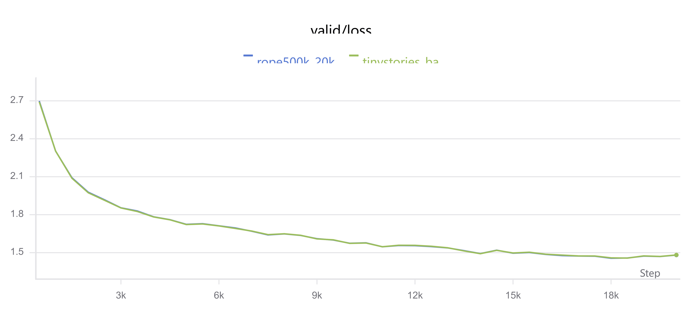
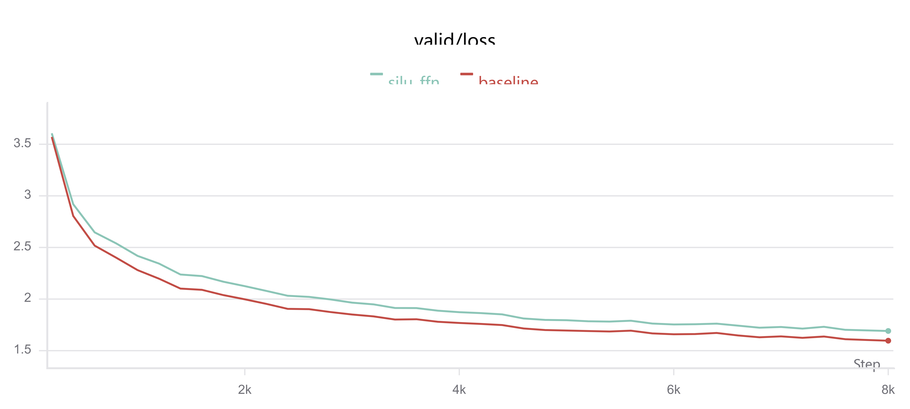
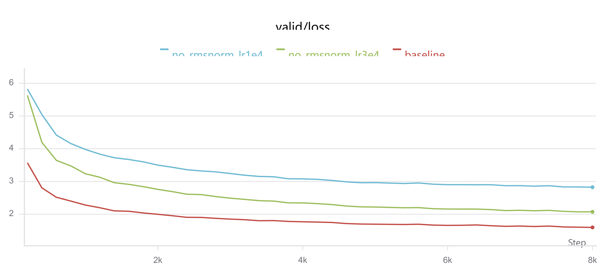
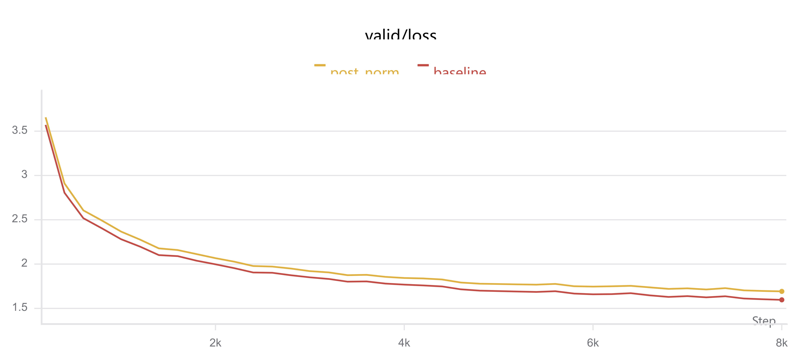
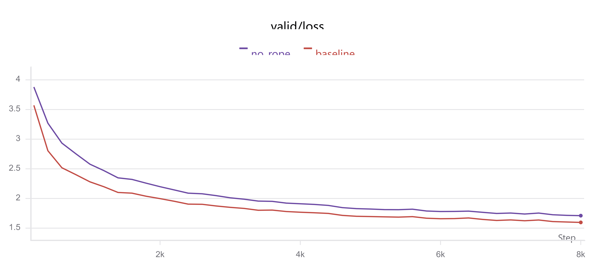
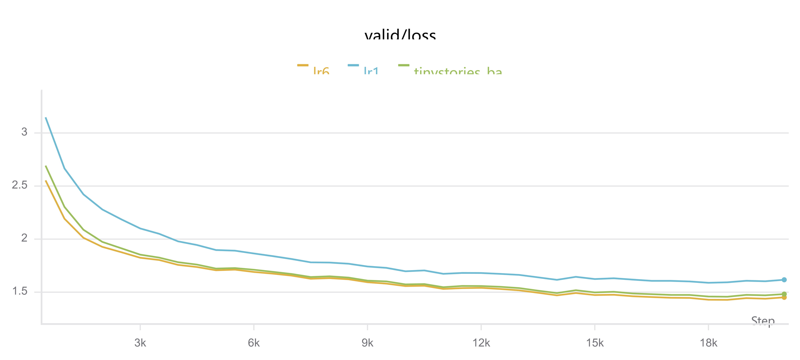
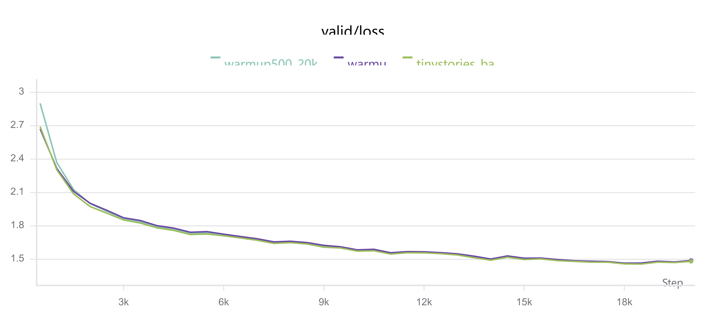
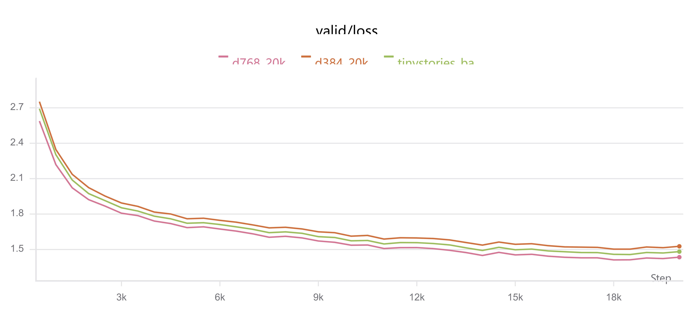

# CS336 Assignment 1：从能跑到看懂

CS336 A1 的实验部分，真正有意思的地方不是把 loss 跑下来，而是回答一个更具体的问题：**一个小型 Transformer 为什么会变好，哪些改动真的重要？**

我以 TinyStories 为主数据集，训练约 20k steps，使用验证集 loss 作为主要指标。基线模型是 4 层、hidden size 为 512、context length 为 256 的 decoder-only Transformer，batch size 32，学习率峰值 `3e-4`，配合 warmup 和 cosine decay。下面的数字都来自同一套实验日志；曲线中的小幅抖动属于正常的 batch 噪声。

## 先看整体曲线

所有实验都有一个很相似的形状：前几百步下降最快，随后进入缓慢收敛阶段，约 10k steps 后收益明显变小。这也是为什么只看最后一个点不够，最好同时观察 early、middle 和 late 三个阶段。

## 1. 组件消融：RMSNorm 和 RoPE 的差别

我先逐个移除或替换 Transformer 组件。

下表是组件消融在 **8k steps** checkpoint 的结果（不是后文 20k 主训练的最终点）：

| 变体 | valid loss @8k | 相对基线 |
| --- | ---: | ---: |
| baseline | 1.597 | 0 |
| SiLU FFN | 1.691 | +0.094 |
| post-norm | 1.692 | +0.095 |
| no RoPE | 1.710 | +0.114 |
| no RMSNorm，lr=`3e-4` | 2.073 | +0.477 |
| no RMSNorm，lr=`1e-4` | 2.825 | +1.229 |

最醒目的结论是：**RMSNorm 对训练稳定性和最终效果都很关键**。去掉它并不是“稍微差一点”，而是让验证损失显著抬高；把学习率降到 `1e-4` 也没有补救效果。

RoPE 的影响更温和但稳定存在。在训练长度内，`no_rope` 的曲线始终比基线高约 0.1。这里要注意实验边界：如果只把 eval context 从 256 改到 512，RoPE 会遇到外推问题，不能把这个结果直接解释成“长上下文一定更需要 RoPE”。在训练和评估都使用 512 的公平对照中，gap 从约 0.114 增到约 0.151，才更接近可比较的结论。

## 2. 学习率、warmup 和 batch size

### 学习率不是越大越好

在其它设置不变时，峰值学习率从 `1e-4` 提高到 `3e-4`、再到 `6e-4`，最终 loss 分别约为 1.617、1.482、1.451。这个范围内更大的学习率更快，但它并不意味着可以无限增大；当前结果只能支持“`6e-4` 比 `3e-4` 好”，不能推出更大的学习率仍然有效。

### warmup 的收益很小，但有解释价值

warmup=200 的基线最终 loss 为 1.482，去掉 warmup 后为 1.489，差距只有 0.007。它没有带来巨大的最终收益，却能降低训练初期的风险，所以我会把它看作一个低成本的稳定化措施，而不是决定性技巧。

### 比较 batch size 时要对齐 token 数

同样训练 20k steps 时，batch size 64 看起来明显更好（1.383 vs 1.482），但它实际上看过两倍 token。把预算改成相同 token 后，batch 64 在 10k steps 的 loss 约为 1.487，几乎回到基线水平；如果同时把学习率提高到 `6e-4`，则约为 1.463，仍有小幅优势。

因此更严谨的说法是：**大 batch 的同 step 优势主要来自处理了更多 token；在 token 对齐后，batch 与学习率的组合仍可能带来额外收益。**

## 3. 模型规模：宽度和深度都有效，但要公平

一次 scaling 实验中，6 层模型（hidden=512）最终 loss 约 1.430，4 层基线为 1.482；hidden=384 约 1.527，hidden=768 约 1.435。模型越深或越宽，效果总体越好，但参数量和计算量也随之增加。

这里有一个容易忽略的公平性问题：如果所有模型都固定 `d_ff=1344`，宽度变化同时改变了 FFN 与 attention 的相对比例。重新按宽度对齐 FFN 后，结果变为：

| 模型 | 参数量 | valid loss |
| --- | ---: | ---: |
| d=384, d_ff=1024 | 14.76M | 1.506 |
| baseline d=512, d_ff=1344 | 22.70M | 1.482 |
| d=768, d_ff=2048 | 43.68M | 1.379 |

这说明原先的趋势没有翻盘，反而更清楚：宽度带来的收益在合理的 FFN 配置下更明显。

## 4. 优化器和学习率调度

我还比较了 cosine decay 和 constant learning rate。两者在约 5k steps 时很接近，但后期 constant `3e-4` 的验证 loss 在 1.50 附近波动，最终为 1.502；cosine 继续下降，最终为 1.482。

这不是“constant lr 直接炸掉”，而是后期缺少衰减，导致收敛更吵、最终略差。类似地，weight decay=0 与基线只差约 0.003，至少在这组短训练和当前模型规模下，无法声称 weight decay 是主要因素。

这组对照没有单独放图，关键数字来自同一份 CSV 日志，避免把其它消融曲线误当成学习率调度实验。

## 5. 我从这些实验中学到什么

1. **先做公平比较，再解释曲线。** 同 step、同 token、同参数量回答的是不同问题。
2. **组件的影响有层次。** RMSNorm 是基础稳定性组件；RoPE 提供稳定但较小的收益；warmup 和 weight decay 在当前设置下属于次要因素。
3. **不要把相关性写成因果。** 例如 512 context 的一次 eval 外推，不能单独证明“长度越长 RoPE 越重要”。
4. **最终 loss 不是全部。** 还应该记录 token 数、墙钟时间、参数量和训练曲线形状，否则很容易把“训练得更多”误认为“方法更好”。

## 结语

A1 让我第一次完整走通了从 tokenizer、Transformer 组件到训练脚本和实验分析的链路。最有价值的结果并不是某个神奇超参数，而是学会了用对照实验拆分问题：先固定变量，再对齐预算，最后只对证据覆盖的范围下结论。这个习惯比把某一次 valid loss 再压低一点更值得带到后面的作业和研究里。
