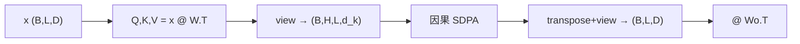

# CS336 A1 · 模型层手撕与踩坑

> 对应代码：`assignment1/assignment1-basics/cs336_basics/linear.py`  
> 下面的代码是你自己过测的手撕版（含踩坑注释与困惑记录）。

> [!info] 公式怎么看
> 请在 **Obsidian 阅读视图**打开（Cursor 预览一般不渲染公式）。
> 行内：`$E=mc^2$`；块级：上下两行各写 `$$`，**中间不要空行**。
> 设置 → 编辑器 → 确认数学公式相关选项开启。


## 目录

- [[#约定与通用坑]]
- [[#Linear / Embedding]]
- [[#Softmax]]
- [[#Cross-Entropy]]
- [[#RMSNorm]]
- [[#SiLU / SwiGLU]]
- [[#Scaled Dot-Product Attention]]
- [[#RoPE]]
- [[#Multi-Head Self-Attention]]
- [[#MHA + RoPE]]
- [[#Transformer Block（Pre-Norm）]]
- [[#Transformer LM]]
- [[#Gradient Clipping]]
- [[#AdamW]]
- [[#Cosine LR Schedule（含 Warmup）]]
- [[#Checkpoint 存取]]
- [[#错误速查表]]

---

## 约定与通用坑

权重约定 **`(d_out, d_in)`**：`y = x @ W.T`

| 点 | 记住 |
|----|------|
| `/` vs `//` | `view` 只要 int → 用 `//` |
| `keepdim=True` | reduce 后要广播就加 |
| `contiguous()` | `transpose` 后再 `view` 前加 |
| mask | adapter：**True=可见** → 盖 `~mask`；自造因果上三角：**True=盖掉** |

> [!warning] 半截代码会毒死整个文件
> 没写完先 `raise NotImplementedError`，别留语法错误半截。

---

## Linear / Embedding

```python
class Linear(nn.Module):
    def __init__(self, in_dim: int, out_dim: int, weights: Float[Tensor, " d_out d_in"]):
        super().__init__()
        self.in_dim = in_dim
        self.out_dim = out_dim
        self.weights = weights

    def forward(self, in_features: Float[Tensor, " ... d_in"]):
        return einops.einsum(
            in_features, self.weights,
            "... d_in, d_out d_in -> ... d_out",
        )


def embedding(
    vocab_size: int,
    d_model: int,
    weights: Float[Tensor, " vocab_size d_model"],
    token_ids: Int[Tensor, " ..."],
) -> Float[Tensor, " ... d_model"]:
    # 也可以直接 weights[token_ids]（高级索引）
    embeddings = torch.stack([weights[token_id] for token_id in token_ids], dim=0)
    return embeddings
```

---

## Softmax

$$
\mathrm{softmax}(x)_{i} = \frac{e^{x_{i}-m}}{\sum_j e^{x_{j}-m}},\quad m=\max x
$$

> [!failure] 错过
> `max`/`sum` 不加 `keepdim=True` → 维被挤掉，广播错。

```python
def softmax(in_features: Float[Tensor, " ... d_model"], dim: int):
    # 错过：sum/max 不加 keepdim=True 时最后一维被挤掉，和原 tensor 广播会错。
    x_max = torch.max(in_features, dim=dim, keepdim=True)[0]
    x = in_features - x_max
    log_sum = torch.log(torch.sum(torch.exp(x), dim=dim, keepdim=True))
    logp = x - log_sum
    return torch.exp(logp)
```

---

## Cross-Entropy

$$
\mathcal{L}=-\frac{1}{B}\sum_b \log p(y_b|x_b)
$$

> [!failure] 错过
> 先 `softmax` 再 `log` → 大 logits 变 `inf`。要用 log-sum-exp 直接算 log-softmax。

```python
def cross_entropy(
    inputs: Float[Tensor, " batch_size vocab_size"],
    targets: Int[Tensor, " batch_size"],
):
    # 错过：先 softmax 再 log —— logits 很大时 softmax 变 inf，log 后全坏。
    # 正确：用 log-sum-exp（先减 max）直接算 log_softmax。
    x_max = torch.max(inputs, dim=-1, keepdim=True)[0]
    x = inputs - x_max
    log_sum = torch.log(torch.sum(torch.exp(x), dim=-1, keepdim=True))
    logp = x - log_sum
    prob = logp[torch.arange(targets.shape[0]), targets]
    return -torch.mean(prob)
```

---

## RMSNorm

$$
\mathrm{RMSNorm}(x)=\frac{x}{\sqrt{\mathrm{mean}(x^2)+\varepsilon}}\odot g
$$

```python
def rmsnorm(
    d_model: int,
    eps: float,
    weights: Float[Tensor, " d_model"],
    in_features: Float[Tensor, " ... d_model"],
) -> Float[Tensor, " ... d_model"]:
    # 注意 keepdim；eps 防除零。测试常用 eps=1e-5
    temp = torch.sqrt(torch.mean(in_features**2, dim=-1, keepdim=True) + eps)
    return in_features / temp * weights
```

---

## SiLU / SwiGLU

$$
\mathrm{SiLU}(x)=x\cdot\sigma(x)
$$

$$
\mathrm{FFN}(x)=\big(\mathrm{SiLU}(xW_1)\odot(xW_3)\big)W_2
$$

| 权重 | 形状 | 角色 |
|------|------|------|
| W1 | `(d_ff, d_model)` | 升维 + SiLU |
| W3 | `(d_ff, d_model)` | gate |
| W2 | `(d_model, d_ff)` | 投回 d_model |

> [!failure] 错过
> 搞混 w1/w2/w3。口诀：`SiLU(W1) * W3`，再 `W2`。

```python
def silu(in_features: Float[Tensor, " ... d_model"]):
    return in_features * torch.sigmoid(in_features)


def swiglu(
    d_model: int,
    d_ff: int,
    w1_weight: Float[Tensor, " d_ff d_model"],
    w2_weight: Float[Tensor, " d_model d_ff"],
    w3_weight: Float[Tensor, " d_ff d_model"],
    in_features: Float[Tensor, " ... d_model"],
) -> Float[Tensor, " ... d_model"]:
    # 错过：搞混 w1/w2/w3。讲义：SiLU(xW1)*(xW3)，再乘 W2。
    Linear1 = Linear(d_ff, d_model, w1_weight)
    Linear2 = Linear(d_model, d_ff, w2_weight)
    Linear3 = Linear(d_ff, d_model, w3_weight)
    return Linear2(silu(Linear1(in_features)) * Linear3(in_features))
```

---

## Scaled Dot-Product Attention

$$
\mathrm{Attention}(Q,K,V)=\mathrm{softmax}\!\left(\frac{QK^\top}{\sqrt{d_k}}+\mathrm{mask}\right)V
$$

> [!failure] 错过
> adapter 里 **True=允许** → 必须 `masked_fill(~mask, -inf)`。mask **在 softmax 前**。

```python
def scaled_dot_product_attention(
    Q: Float[Tensor, " ... queries d_k"],
    K: Float[Tensor, " ... keys d_k"],
    V: Float[Tensor, " ... keys d_v"],
    mask: Bool[Tensor, " ... queries keys"] | None = None,
) -> Float[Tensor, " ... queries d_v"]:
    d_k = Q.shape[-1]
    # mask 必须在 softmax 之前
    scores = einops.einsum(
        Q, K, "... queries d_k, ... keys d_k -> ... queries keys"
    ) / math.sqrt(d_k)
    if mask is not None:
        # 错过：masked_fill(mask, ...) 会把可见位置盖掉
        # True=允许 → 盖 ~mask
        scores = scores.masked_fill(~mask, float("-inf"))
    scores = softmax(scores, dim=-1)
    return einops.einsum(
        scores, V, "... queries keys, ... keys d_v -> ... queries d_v"
    )
```

---

## RoPE

$$
\omega_i = \theta^{-2i/d}
$$

$$
\begin{pmatrix} x' \\ y' \end{pmatrix}
=
\begin{pmatrix} \cos\phi & -\sin\phi \\ \sin\phi & \cos\phi \end{pmatrix}
\begin{pmatrix} x \\ y \end{pmatrix}
$$

实现：`freq = arange(0,d,2)/d`，`ω = 1/theta**freq`，`φ = p * ω`。

> [!failure] 错过
> 少除 `/d_k` → 变成 `θ^{-0},θ^{-2},θ^{-4}...`。现象：pos0 对、pos1 前两维对、后面全炸。

```python
def rope(
    d_k: int,
    theta: float,
    max_seq_len: int,
    in_query_or_key: Float[Tensor, " ... sequence_length d_k"],
    token_positions: Int[Tensor, " ... sequence_length"],
) -> Float[Tensor, " ... sequence_length d_k"]:
    assert d_k % 2 == 0
    *prefix, seq_len, d_k = in_query_or_key.shape

    # 错过：arange(0,d_k,2) 后直接 1/theta**freq，少了 /d_k
    # 正确：讲义 θ^{-2i/d} = (0,2,4,...)/d_k 再进指数
    freq_seq = torch.arange(0, d_k, 2, dtype=torch.float32) / d_k
    rope_theta = 1 / theta**freq_seq  # (d_k//2,)

    # positions: (..., seq) → (..., seq, 1) 与 ω 广播 → (..., seq, d_k//2)
    angles = token_positions.unsqueeze(-1) * rope_theta
    cos = angles.cos()
    sin = angles.sin()

    # 成对 (x0,x1),(x2,x3),...
    x = in_query_or_key.view(*prefix, seq_len, d_k // 2, 2)
    rope_x = torch.stack(
        [
            x[..., 0] * cos - x[..., 1] * sin,
            x[..., 0] * sin + x[..., 1] * cos,
        ],
        dim=-1,
    )
    return rope_x.view(*prefix, seq_len, d_k)
```

---

## Multi-Head Self-Attention



> [!failure] 错过
> `d_k = d_model / num_heads` 是 float → `view` TypeError。要用 `//`。  
> `transpose` 后要 `contiguous()` 再 `view`。

```python
def multihead_self_attention(
    d_model: int,
    num_heads: int,
    q_proj_weight: Float[Tensor, " d_model d_model"],
    k_proj_weight: Float[Tensor, " d_model d_model"],
    v_proj_weight: Float[Tensor, " d_model d_model"],
    o_proj_weight: Float[Tensor, " d_model d_model"],
    in_features: Float[Tensor, " ... sequence_length d_model"],
) -> Float[Tensor, " ... sequence_length d_model"]:
    *prefix, seq_len, d_model = in_features.shape
    seq_len = in_features.shape[-2]
    in_features = in_features.view(-1, seq_len, d_model)
    batch_size = in_features.shape[0]

    # 权重 (d_out, d_in) → x @ W.T
    Q = in_features @ q_proj_weight.T
    K = in_features @ k_proj_weight.T
    V = in_features @ v_proj_weight.T

    # 错过：/ 得到 float，view 要 int → 必须 //
    d_k = d_model // num_heads
    Q = Q.view(batch_size, seq_len, num_heads, d_k).transpose(1, 2)  # (B,H,L,d_k)
    K = K.view(batch_size, seq_len, num_heads, d_k).transpose(1, 2)
    V = V.view(batch_size, seq_len, num_heads, d_k).transpose(1, 2)

    scores = torch.matmul(Q, K.transpose(-2, -1)) / math.sqrt(d_k)
    # 自造因果：True = 盖掉未来
    mask = torch.triu(torch.ones(seq_len, seq_len), diagonal=1)
    scores = scores.masked_fill(mask, float("-inf"))
    scores = softmax(scores, dim=-1)

    results = torch.matmul(scores, V)
    # 错过：transpose 后直接 view 可能不连续
    results = results.transpose(1, 2).contiguous().view(batch_size, seq_len, d_model)

    outputs = torch.matmul(results, o_proj_weight.T)
    return outputs.view(*prefix, seq_len, d_model)
```

---

## MHA + RoPE

**RoPE 加在拆 head 后的 Q、K；V 不加。** 频率用 head dim `d_k`。

> [!failure] 错过
> 对整段 `in_features` 先 RoPE 再投影 —— 错。应对每个 head 的 Q/K 旋转。

```python
def multihead_self_attention_with_rope(
    d_model: int,
    num_heads: int,
    max_seq_len: int,
    theta: float,
    q_proj_weight: Float[Tensor, " d_model d_model"],
    k_proj_weight: Float[Tensor, " d_model d_model"],
    v_proj_weight: Float[Tensor, " d_model d_model"],
    o_proj_weight: Float[Tensor, " d_model d_model"],
    in_features: Float[Tensor, " ... sequence_length d_model"],
    token_positions: Int[Tensor, " ... sequence_length"] | None = None,
) -> Float[Tensor, " ... sequence_length d_model"]:
    *prefix, seq_len, d_model = in_features.shape
    in_features = in_features.view(-1, seq_len, d_model)
    batch_size = in_features.shape[0]

    # 错过：曾对整段 x 先 RoPE 再 QKV；应先投影、拆 head，再转 Q/K
    Q = in_features @ q_proj_weight.T
    K = in_features @ k_proj_weight.T
    V = in_features @ v_proj_weight.T

    # 错过：/ 得 float；assert 16.0==16 能过，view 报 TypeError
    d_k = d_model // num_heads
    Q = Q.view(batch_size, seq_len, num_heads, d_k).transpose(1, 2)
    K = K.view(batch_size, seq_len, num_heads, d_k).transpose(1, 2)
    V = V.view(batch_size, seq_len, num_heads, d_k).transpose(1, 2)

    # RoPE（别忘 /d_k）；cos/sin 与 (B,H,L,d_k//2) 广播
    freq_seq = torch.arange(0, d_k, 2, dtype=torch.float32) / d_k
    rope_theta = 1 / theta**freq_seq
    angles = token_positions.unsqueeze(-1) * rope_theta
    cos, sin = angles.cos(), angles.sin()

    Q = Q.view(batch_size, num_heads, seq_len, d_k // 2, 2)
    rope_Q = torch.stack(
        [Q[..., 0] * cos - Q[..., 1] * sin, Q[..., 0] * sin + Q[..., 1] * cos],
        dim=-1,
    ).view(batch_size, num_heads, seq_len, d_k)

    K = K.view(batch_size, num_heads, seq_len, d_k // 2, 2)
    rope_K = torch.stack(
        [K[..., 0] * cos - K[..., 1] * sin, K[..., 0] * sin + K[..., 1] * cos],
        dim=-1,
    ).view(batch_size, num_heads, seq_len, d_k)

    scores = torch.matmul(rope_Q, rope_K.transpose(-2, -1)) / math.sqrt(d_k)
    mask = torch.triu(torch.ones(seq_len, seq_len, dtype=torch.bool), diagonal=1)
    scores = scores.masked_fill(mask, float("-inf"))
    attn = softmax(scores, dim=-1)

    results = torch.matmul(attn, V)
    results = results.transpose(1, 2).contiguous().view(batch_size, seq_len, d_model)
    outputs = results @ o_proj_weight.T
    return outputs.view(*prefix, seq_len, d_model)
```

也可复用 `rope(d_k, theta, max_seq_len, Q, token_positions)`，注意 Q 形状要是 `(..., seq, d_k)`（可对每个 head 维广播或 reshape）。

---

## Transformer Block（Pre-Norm）

```text
x = x + Attn(RMSNorm(x))   # 残差在子层外面
x = x + FFN(RMSNorm(x))
```

残差加的是：**进子层前的原 x** + **子层输出**。

```python
def transformer_block(
    d_model: int,
    num_heads: int,
    d_ff: int,
    max_seq_len: int,
    theta: float,
    weights: dict[str, Tensor],
    in_features: Float[Tensor, " batch sequence_length d_model"],
) -> Float[Tensor, " batch sequence_length d_model"]:
    batch_size, seq_len, d_model = in_features.shape
    # adapter 不给 positions → 自己造 0..L-1
    token_positions = (
        torch.arange(seq_len, dtype=torch.long, device=in_features.device)
        .unsqueeze(0)
        .expand(batch_size, -1)
    )

    # pre-norm + 外侧残差
    x = rmsnorm(d_model, 1e-5, weights["ln1.weight"], in_features)
    x = multihead_self_attention_with_rope(
        d_model, num_heads, max_seq_len, theta,
        weights["attn.q_proj.weight"],
        weights["attn.k_proj.weight"],
        weights["attn.v_proj.weight"],
        weights["attn.output_proj.weight"],
        x, token_positions,
    )
    out1 = x + in_features  # 残差1
    in2 = out1

    x = rmsnorm(d_model, 1e-5, weights["ln2.weight"], in2)
    x = swiglu(
        d_model, d_ff,
        weights["ffn.w1.weight"],
        weights["ffn.w2.weight"],
        weights["ffn.w3.weight"],
        x,
    )
    return in2 + x  # 残差2
```

---

## Transformer LM

```text
ids → Embed → Block×N → RMSNorm(ln_final) → LM Head → logits
```

没有位置 Embedding；位置靠 RoPE。输出 **不要** 再 softmax。

> [!failure] 错过1
> `weights["layers.{i}.attn..."]` 字面量 → `KeyError`。要用 f-string 或剥前缀。

> [!failure] 错过2
> 把十几个张量当位置参数塞进 `transformer_block` → `TypeError: takes 7 but 15 given`。应传短键 `weights` dict。

```python
def transformer_lm(
    vocab_size: int,
    context_length: int,
    d_model: int,
    num_layers: int,
    num_heads: int,
    d_ff: int,
    rope_theta: float,
    weights: dict[str, Tensor],
    in_indices: Int[Tensor, " batch_size sequence_length"],
) -> Float[Tensor, " batch_size sequence_length vocab_size"]:
    # (B, L) → (B, L, D)
    x = weights["token_embeddings.weight"][in_indices]

    for i in range(num_layers):
        # 错过1：普通字符串 "layers.{i}...." 不会插值
        # 错过2：不要拆成 15 个位置参数；传 dict
        # 正确：剥 layers.{i}. → 与单 block 相同的短键
        prefix = f"layers.{i}."
        block_weights = {
            k[len(prefix):]: v
            for k, v in weights.items()
            if k.startswith(prefix)
        }
        x = transformer_block(
            d_model, num_heads, d_ff, context_length, rope_theta,
            block_weights, x,
        )

    x = rmsnorm(d_model, 1e-5, weights["ln_final.weight"], x)
    # 未归一化 logits
    x = x @ weights["lm_head.weight"].T
    return x
```

---

## get_batch（附）

```python
def get_batch(dataset: npt.NDArray, batch_size: int, context_length: int, device: str):
    max_start = len(dataset) - context_length
    starts = np.random.randint(0, max_start + 1, size=(batch_size,))
    inputs, outputs = [], []
    for start in starts:
        inputs.append(dataset[start : start + context_length])
        outputs.append(dataset[start + 1 : start + context_length + 1])
    return (
        torch.tensor(inputs, dtype=torch.long, device=device),
        torch.tensor(outputs, dtype=torch.long, device=device),
    )
```

---

## Gradient Clipping

### 在算什么

所有参数梯度拼在一起算 **全局 L2**；若超过 `max_l2_norm`，整体乘缩放因子，使范数压回上限。**原地**改 `p.grad`。

### 我的错误 / 注意

> [!failure] 错过：`if grads is None`
> `grads` 是 list，空的时候是 `[]`，**永远不是 `None`**。应写成 `if not grads: return`。  
> 另：只处理 `p.grad is not None`（测试会冻住部分参数）。

```python
def gradient_clipping(parameters, max_l2_norm: float) -> None:
    grads = []
    for p in parameters:
        if p.grad is not None:
            grads.append(p.grad.view(-1))

    # 错过：写成 if grads is None —— list 空时是 []，不是 None
    if not grads:
        return

    grads = torch.cat(grads)
    eps = 1e-5
    l2 = torch.sqrt(torch.sum(grads**2)).item()
    if l2 > max_l2_norm:
        scale = max_l2_norm / (l2 + eps)
        for p in parameters:
            if p.grad is not None:
                p.grad.mul_(scale)
```

---

## AdamW

### 在算什么

`torch.optim.Optimizer` 子类：维护每个参数的 $m,v$，用偏置修正后的 $\hat{m}/(\sqrt{\hat{v}}+\varepsilon)$ 更新，并做 **解耦 weight decay**（衰减直接作用在参数上，不混进梯度）。

### 困惑：`param_groups` / `group` / `params` 是什么？

> [!question] 困惑（你在注释里问过）
> `param_groups` 和 `params` 有什么区别？`group` 是什么意思？

```text
Optimizer
 └── param_groups     # list：多组超参
      └── group       # 一个 dict：一组超参 + 这组参数
           ├── "lr", "betas", "eps", "weight_decay", ...
           └── "params"   # list[Parameter]
```

- **`param_groups`**：组的列表  
- **`group`**：其中一组（dict）  
- **`group["params"]`**：这一组里要更新的参数  

为什么要「组」：同一优化器里，backbone / head 可以有不同 `lr`、`weight_decay`。  
作业测试通常只有 **一个 group**（`AdamW(model.parameters(), ...)` 自动收成一组）。

另：**`self.state[p]`** 是**每个参数自己的**动量字典，和 group 无关。  
`group["step"]` 若读了不用，就是死代码；真正计数用 `state['step']`。

### 困惑：`get_adamw_cls` 怎么返回？

> [!failure] 错过：`return AdamW()`
> 名字里的 `cls` = 返回 **类本身**。测试会：
> ```python
> opt_class = get_adamw_cls()
> opt = opt_class(model.parameters(), lr=..., ...)
> ```
> `return AdamW()` 已经是实例，后面再 `(...)` 会挂。  
> **正确：`return AdamW`**（不要括号）。

### 我的错误：`lr` 乘两次

> [!failure] 错过：`step_size` 已含 `lr`，else 里又乘一次
> ```python
> step_size = lr * exp_avg / bias_correction1 / denom  # 已含 lr
> # 错：p = p - step_size * lr   → 变成 lr²
> # 对：有/无 weight_decay，Adam 项都只减一份 step_size
> ```

### 手撕代码

```python
class AdamW(torch.optim.Optimizer):
    def __init__(self, parameters, lr, betas, eps, weight_decay):
        defaults = {
            "lr": lr,
            "betas": betas,
            "eps": eps,
            "weight_decay": weight_decay,
        }
        super().__init__(parameters, defaults)

    def step(self, closure=None):
        with torch.no_grad():
            loss = None
            if closure is not None:
                loss = closure()
            for group in self.param_groups:
                lr = group["lr"]
                beta1, beta2 = group["betas"]
                eps = group["eps"]
                weight_decay = group["weight_decay"]
                for p in group["params"]:
                    if p.grad is None:
                        continue
                    grad = p.grad.data
                    state = self.state[p]
                    if len(state) == 0:
                        state["step"] = 0
                        state["exp_avg"] = torch.zeros_like(p.data)
                        state["exp_avg_sq"] = torch.zeros_like(p.data)
                    state["step"] += 1
                    t = state["step"]
                    exp_avg = state["exp_avg"]
                    exp_avg_sq = state["exp_avg_sq"]
                    exp_avg = exp_avg * beta1 + (1 - beta1) * grad
                    exp_avg_sq = exp_avg_sq * beta2 + (1 - beta2) * (grad**2)
                    bias_correction1 = 1 - beta1**t
                    bias_correction2 = 1 - beta2**t
                    denom = torch.sqrt(exp_avg_sq / bias_correction2) + eps
                    step_size = lr * exp_avg / bias_correction1 / denom
                    # Adam 项只减一份 step_size；decay 另减 lr*wd*p
                    if weight_decay != 0:
                        p.data = p.data - step_size - lr * weight_decay * p.data
                    else:
                        p.data = p.data - step_size
                    state["exp_avg"] = exp_avg
                    state["exp_avg_sq"] = exp_avg_sq
            return loss


def get_adamw_cls():
    return AdamW  # 返回类，不是 AdamW()
```

> [!tip] 顺序
> 讲义对「先 weight decay 还是先 Adam 更新」有过修正；测不过时按讲义拆成两步核对先后。

---

## Cosine LR Schedule（含 Warmup）

### 原理：三段全局 $\alpha(t)$

| 阶段 | 条件 | 行为 |
|------|------|------|
| Warmup | `it < Tw` | 从 0 **线性**爬到 $\alpha_{\mathrm{max}}$ |
| Cosine | `Tw ≤ it ≤ Tc` | 半个余弦从 $\alpha_{\mathrm{max}}$ **平滑降到** $\alpha_{\mathrm{min}}$ |
| 平台 | `it > Tc` | 恒为 $\alpha_{\mathrm{min}}$ |

Cosine 段：`progress = (it-Tw)/(Tc-Tw) ∈ [0,1]`，  
`0.5*(1+cos(π·progress))` 从 1→0。

### 为什么这样设计？

> [!question] 困惑
> 学习率调度器的原理是什么？为什么这样设计？

1. **Warmup**：初期参数乱、梯度噪，太大 lr 易炸 → 先小后大。  
2. **Cosine 退火**：后期靠近谷底，太大步长会抖 → 平滑变小，比「突然砍半」少突变。  
3. **落到 $\alpha_{\mathrm{min}}$ 而非 0**：还能微调，不完全停学。

这是 **训练日程（只看迭代数）**，和「某个参数梯度大不大」无关。

### 和 AdamW 自适应有什么区别？

> [!question] 困惑
> 和 AdamW 里面的自适应学习率有什么区别？

| | Cosine schedule | AdamW 自适应 |
|--|-----------------|--------------|
| 改什么 | 全体共用的 **全局 `lr`** | 每个参数坐标的 **有效步长** |
| 依据 | 只看 **`it`** | 看该参数 **梯度历史** $m,v$ |
| 位置 | 外面的 $\alpha_t$ | $\alpha_t\cdot\hat{m}/(\sqrt{\hat{v}}+\varepsilon)$ |

二者 **叠加**：schedule 定今天的 $\alpha_t$，AdamW 在这个 $\alpha_t$ 下再按维度缩放。  
**不是替代关系。**

### 手撕代码

```python
def get_lr_cosine_schedule(
    it: int,
    max_learning_rate: float,
    min_learning_rate: float,
    warmup_iters: int,
    cosine_cycle_iters: int,
):
    if it < warmup_iters:
        lr = max_learning_rate * (it / warmup_iters)
    elif warmup_iters <= it <= cosine_cycle_iters:
        progress = (it - warmup_iters) / (cosine_cycle_iters - warmup_iters)
        lr = min_learning_rate + 0.5 * (max_learning_rate - min_learning_rate) * (
            1 + math.cos(math.pi * progress)
        )
    else:
        lr = min_learning_rate
    return lr
```

自检（测试期望）：`Tw=7, Tc=21, αmax=1, αmin=0.1` → `it=0→0`，`it=7→1`，`it=14→0.55`，`it≥21→0.1`。

---

## Checkpoint 存取

### 在做什么

把训练断点序列化：`model` 权重 + `optimizer` 状态（含 Adam 的 $m,v$）+ `iteration`。  
Load 后应能接着训，且 `state_dict` 对齐。

```python
def save_checkpoint(model, optimizer, iteration, out):
    payload = {
        "model_state_dict": model.state_dict(),
        "optimizer_state_dict": optimizer.state_dict(),
        "iteration": iteration,
    }
    torch.save(payload, out)


def load_checkpoint(src, model, optimizer):
    payload = torch.load(src)
    model.load_state_dict(payload["model_state_dict"])
    optimizer.load_state_dict(payload["optimizer_state_dict"])
    return payload["iteration"]  # 必须 return 迭代数
```

> [!tip]
> `out` / `src` 可以是路径或 file-like；键名 save/load 必须一致。  
> 变量名别用 `dict`（会遮蔽内置类型）。

---

## 错误速查表

| 症状 | 优先怀疑 |
|------|----------|
| pos0 对、后面全炸 | RoPE 频率少了 `/d` |
| `view` TypeError got float | `/` → `//` |
| Attention 大面积错 | mask 极性；RoPE 加在 x 上；少 `.T` |
| loss nan/inf | CE 用了 `log(softmax)` |
| 形状炸 | 忘 `keepdim` |
| `KeyError: layers.{i}....` | 没用 f-string |
| `takes 7 ... but 15` | LM 应传 weights dict |
| 无关测试 import 失败 | `linear.py` 语法错误半截 |
| `get_adamw_cls` 后再 `(params,...)` 报错 | 返回了实例 `AdamW()`，应 `return AdamW` |
| AdamW 数值差很多 / lr 像平方 | `step_size` 已含 `lr` 又乘了一次 |
| clip 空梯度路径不对 | `grads is None` 应为 `not grads` |
| cosine 在边界不对 | 核对 `it < Tw` / `Tw≤it≤Tc` / `it>Tc` 三段 |

---

## 自测命令

```bash
cd assignment1/assignment1-basics
uv run pytest tests/test_model.py::test_rope -v
uv run pytest tests/test_model.py::test_multihead_self_attention_with_rope -v
uv run pytest tests/test_model.py::test_transformer_block -v
uv run pytest tests/test_model.py::test_transformer_lm -v

uv run pytest tests/test_nn_utils.py::test_gradient_clipping -v
uv run pytest tests/test_optimizer.py::test_adamw -v
uv run pytest tests/test_optimizer.py::test_get_lr_cosine_schedule -v
uv run pytest tests/test_serialization.py::test_checkpointing -v
```

---

## 一句话

> **数值**减 max；**形状**`//`/`keepdim`/`contiguous`；**mask**在 softmax 前且分清极性；**RoPE** $\theta^{-2i/d}$ 只转 Q/K；**Block** pre-norm + 外侧残差；**LM** 剥 `layers.{i}.` 成 dict；**AdamW** 返回类、`lr` 别乘两次；**cosine** 管全局日程，**Adam** 管按维自适应，二者叠加。
